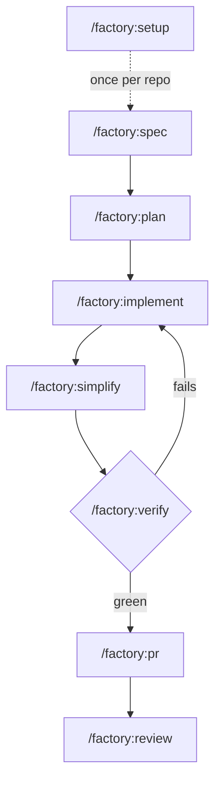

## The loop

The point is to cut the babysitting. The human agrees a spec and a plan,
then the agent works slices one at a time or in parallel worktrees. Each
slice ends in a verification loop the agent cannot talk its way out of, and
each lands as one pull request in a stack.

## Who does what

The human owns three decisions and the agent owns everything in between.

| Gate | Human | Agent |
|---|---|---|
| Spec | Answers the open questions, marks the spec agreed | Gathers evidence, drafts requirements and seams |
| Plan | Approves the slices before anything is published | Slices the spec, computes waves, publishes to the tracker |
| Ship | Starts `/factory:pr`, merges | Builds with TDD, verifies until green, writes the PR body |

Three skills say in their description that only the user may start them:
`setup`, `plan` (for publishing), and `pr`. The agent may run every other
skill on its own when the request matches the skill's description.

## How the skills are built

The skills are thin, owned wrappers. The method inside them comes from
upstream skills by Matt Pocock, the Cursor pstack team, Addy Osmani, and
CodeRabbit, vendored verbatim under `upstream/` and pinned by content hash,
plus Drew's own tools: [poly-crap](https://github.com/drew-simmons/poly-crap),
[lawbook](https://github.com/drew-simmons/lawbook), and
[verify-loop](https://github.com/drew-simmons/verify-loop). See
[Upstream skills](./upstream) for how the vendoring works.

## Where to go next

- [Quickstart](./quickstart) installs the plugin and runs the loop once.
- [When to reach for factory](./when-to-use) sizes a change as small,
  medium, or large and says which skills each size needs.
- [The loop](./workflow) walks one feature through every stage and names
  the artifact each stage writes.
- [Skills](./skills) is the reference, one page per skill.
