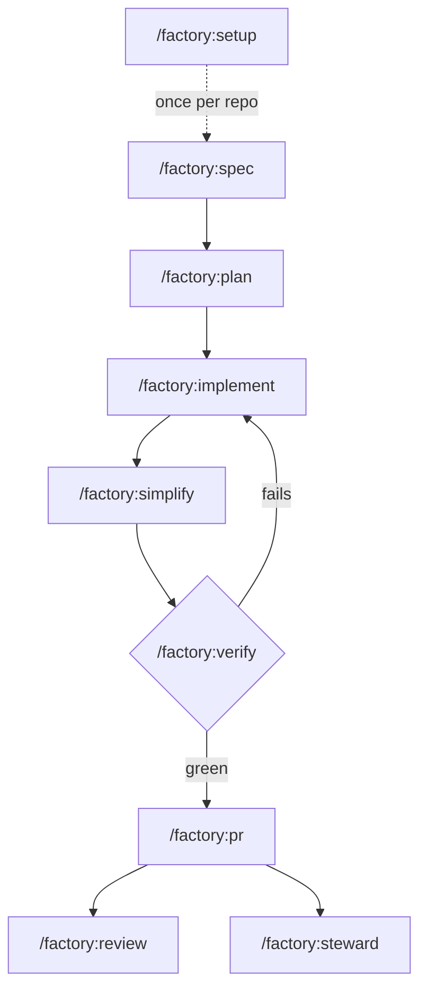

## Shape

`/factory:run <size>` runs the loop end to end for one change and stops
only at the human gates below; `/factory:steward` takes over once the
PRs are open.

Every stage reads `factory.toml` first and falls back to detection when a
key is missing. Every stage after `spec` reads the files the earlier
stages wrote. Nothing is held in conversation state that a fresh session
could not pick up from disk.

## Artifacts

| Stage | Reads | Writes |
|---|---|---|
| `setup` | Marker files, `git remote`, `lawbook.yaml` | `factory.toml` |
| `spec` | The conversation, linked issues, nearby code and tests | `<spec_dir>/<slug>/spec.md` |
| `plan` | `spec.md` with `Status: agreed` | `<spec_dir>/<slug>/plan.md`, tracker items or `issues/NN-<task>.md` |
| `implement` | `plan.md`, `spec.md` | Commits on `<slug>/NN-<task>`, `.factory/loop.local.md` |
| `simplify` | The diff against `base` | Edits and a `refactor` commit |
| `verify` | The diff against `base`, `factory.toml` `[verify]` | `.verify/summary.txt`, `crap.json`, `lawbook.json`, `green` |
| `pr` | `plan.md`, `.verify/summary.txt`, `.verify/green` | A PR on the forge |
| `review` | The diff against the slice's parent, `spec.md` | `<spec_dir>/<slug>/review-NN.md`, findings in the reply |
| `run` | `run.md`, everything the stages wrote | `<spec_dir>/<slug>/run.md` |
| `steward` | `plan.md`, the forge | Pushes on the frontier branch, thread replies |

`spec_dir` defaults to `docs/specs`. `base` defaults to `origin/main`.

## Stage by stage

### Spec

`/factory:spec` gathers evidence first: the conversation, any linked
issue, nearby code, tests, and ADRs. Facts come from the repository;
decisions come from the user. It drafts the seams, the highest public
boundaries tests will run against, and runs at most one grilling round
for decisions the repo cannot settle. The result is `spec.md` with
numbered requirements in EARS form (`R1`, `R2`), testing decisions,
implementation decisions, out of scope, assumptions, and open questions.
It starts at `Status: draft` and becomes `Status: agreed` when the user
has answered the questions.

### Plan

`/factory:plan` refuses a draft spec. From an agreed one it writes
tracer-bullet slices: each is one narrow path through every layer,
demoable on its own, sized for one fresh context window. Each slice names
its requirement ids, blockers, `Branch`, `Parent`, what it delivers, and
observable acceptance checks.

The stack is a base-branch chain. The root slice's parent is `base`. Each
later slice's parent is the branch of the slice it is blocked by. Slices
in one wave share no blockers and no write set, so they can run in
parallel worktrees.

The breakdown is presented as a numbered list with three questions:
granularity, blocking edges, merge or split. Only after the user approves
does the skill publish, per `tracker.kind`: one issue file per slice for
`local`, or a tracking item plus one item per slice on GitHub, GitLab, or
Jira.

### Implement

`/factory:implement <NN>` works one slice. It confirms every blocker is
done, switches to the slice branch (creating it from `Parent` if needed),
marks the slice claimed, then runs the red-green loop: for each acceptance
check, one failing test at the agreed seam, the smallest code that passes,
run the file. It runs the full suite once, then `/factory:verify` until
exit 0 or `max_iterations`, and commits with a conventional message that
cites the slice and requirement ids.

`/factory:implement --all` computes the frontier and spawns one
`factory:implementer` agent per frontier slice, each in its own git
worktree. When an agent reports done, the parent confirms its branch is
green and pushed, marks the slice done, recomputes the frontier, and
spawns the next wave.

### Simplify

`/factory:simplify` reads every changed file in full and, in order:
deletes dead code, drops narrating comments and defensive guards the spec
did not ask for, flattens nesting, replaces single-caller abstractions
with the call itself, and fixes the judgement-free smells left over.
Behavior stays identical and existing tests pass without edits. It ends
by running verify.

### Verify

`/factory:verify` runs one script with one exit code. Stage 0 rejects any
change that lowers the bar: a new suppression, a skipped or deleted test,
a lowered threshold. Stages 1 to 6 run cheapest first and stop sending
model requests on a red tree. The agent fixes only what the summary
names and never edits thresholds, rules, or tests to get green. See
[The verify loop](./verify-loop).

With `--loop`, the skill writes `.factory/loop.local.md`. While that file
exists, the plugin's Stop hook reruns the script when the turn tries to
end and blocks on red with the findings, up to `max_iterations`.
`/factory:implement` arms it the same way. Sessions without that file are
never touched.

### PR

`/factory:pr` runs only when the user starts it. It refuses on a red tree
or with uncommitted changes, rebases the slice onto its parent when the
parent moved, pushes, and opens the PR against the parent branch with a
body built from the verify evidence. Never draft, never merge, never
force-push. With `--babysit` it works the lowest unmerged PR of the stack
through conflicts, review threads, and CI, and stops at merge-ready.

### Review

`/factory:review` pins the fixed point (the slice's parent, or `base`),
diffs what would merge, and spawns two read-only `factory:reviewer`
agents in one message: Standards and Spec. CodeRabbit's CLI adds a third
section when it is authenticated. Findings are `[P0]` to `[P3]`, each with
a path and line, never reranked across axes. The reply names what
`/factory:implement` should pick up next.

## The human's gates

1. Answer the spec's open questions.
2. Approve the plan before it publishes.
3. Start `/factory:pr` (or give `/factory:run` the go).
4. Merge, once `/factory:steward` reports the frontier merge-ready.

Everything between those four is the agent's.
